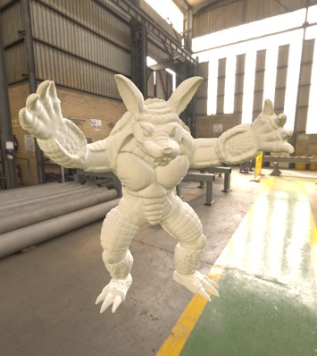

SHH 🤫
===

SHH (**S**pherical **H**armonics **H**elpers) is a Lua/[LÖVR](https://lovr.org) library for
computing spherical harmonics and using them for lighting.  It uses compute shaders to generate
spherical harmonics on the GPU at realtime speeds.

Spherical What Now?
---

Spherical harmonics basically store a "ball of light" using some fancy math and a very small amount
of data.  They're similar to a skybox, but more blurry and only take up about 100 bytes!  They're a
quick, cheap way to add soft diffuse lighting to objects so they look like they belong in a scene.

[Here](https://martinoshelf.neocities.org/spherical-harmonics-lovr) is a blog post that goes into
more of the math behind spherical harmonics, with great diagrams and sample code!

Example
---

```lua
local shh = require 'shh'

function lovr.load()
  skybox = lovr.graphics.newTexture('sky.hdr', {
    usage = { 'storage', 'sample' }
  })

  SH = shh.new(skybox)

  model = lovr.graphics.newModel('armordillo.glb')
end

function lovr.draw(pass)
  pass:skybox(skybox)
  shh.setShader(pass, SH)
  pass:draw(model)
end
```



Usage
---

First, copy the `shh.lua` file to your project and require it.

To create a new spherical harmonics object, use `SH = shh.new(arg)`.  The argument can be:

- `nil` - Create an empty object (all coefficients will be zero).
- `table` - A table of 27 numbers or a table of 9 tables (each with 3 numbers) containing the raw
  coefficients.
- `Texture` - A Texture to compute the coefficients from.  It can be a cubemap texture or an
  equirectangular texture (2d spherical image with 2:1 aspect ratio).

A SH object is simply a table of 9 basis vectors, so you can access `SH[x][y]` to get the raw
coefficient values (where x is 1-9 and y is 1-3).

Spherical harmonics objects have the following methods:

- `SH:evaluate(dx, dy, dz)` - Get the color at a given direction.  The direction can 3 numbers or a
  `vec3` object, and should be normalized.  This basically blends all the coefficients together
  based on the direction to get a final color value.
- `SH:addAmbientLight(r, g, b)` - Add an ambient light to the coefficients.  This will be added to
  any existing light in the SH object.
- `SH:addDirectionalLight(dx, dy, dz, r, g, b)` - Add a directional light to the coefficients.  This
  will be added to any existing light in the SH object.  The direction vector should be the
  direction *towards* the light.  Note that due to math reasons, a small amount of light will "leak"
  in the opposite direction of the light.
- `SH:add(other)` - Add another spherical harmonics object to this one, essentially summing their
  light together.
- `SH:lerp(other, t)` - Blend this spherical harmonics object with another one.  `t` is a value from
  zero to one, where 0 will keep `SH` the same and 1 will set `SH` equal to `other`.
- `SH:scale(x)` - Multiply all coefficients by `x`, which will have brightening/darkening effect.

Lighting
---

There are a few ways to use spherical harmonics for lighting.

SHH provides a convenience function `shh.setShader(pass, SH)` which will set a shader on `pass` that
will light objects using the `SH` object.

However, spherical harmonics lighting can be integrated into your own shaders and combined with
direct lighting, PBR materials, etc.  To make this easier, SHH has a `shader.glsl` file that can be
included in custom shaders.  It defines an `evaluateSH` function that takes a spherical harmonics
basis and a direction vector, and returns a color:

```glsl
#include "shh/shader.glsl"

layout(set = 2, binding = 0) uniform SH { vec3 sh[9]; };

vec4 lovrmain() {
  vec3 color = evaluateSH(sh, normalize(Normal)) / PI;
  return vec4(color, 1.);
}
```

**Note** that when doing lighting, you probably want to divide the result from `evaluateSH` by `PI`.
This applies the Lambertian BRDF which gets the values in a more appropriate range.

Advanced Compute Shader API
---

To generate spherical harmonics from a Texture using a compute shader, use `shh.compute`:

```lua
shh.compute(pass, texture, buffer, bufferOffset)
```

Example:

```lua
local pass = lovr.graphics.newPass()
local skybox = lovr.graphics.newTexture('skybox.hdr', { usage = 'storage' })
local buffer = lovr.graphics.newBuffer('vec4', 9)
shh.compute(pass, skybox, buffer)
lovr.graphics.submit(pass)
SH = shh.new(buffer:getData())

-- or, compute SH dynamically every frame:
function lovr.draw(pass)
  shh.compute(pass, skybox, buffer)
  shh.setShader(pass, buffer)
  pass:draw(model)
end
```

This is a lower-level method that will run a compute shader on `pass` that computes spherical
harmonics coefficients from `texture` and writes them to `buffer` (at offset `bufferOffset`, which
defaults to zero).  It can be used to compute spherical harmonics for many textures on the GPU in
parallel.

Like `shh.new`, the texture should be a cubemap or an equirectangular texture.  It must have the
`storage` usage.  Currently its format must be `rgba8`, `rgba16f`, `rgba32f`, or `rg11b10f`.

> Tip: You can pass a texture view to this function to compute spherical harmonics from a smaller
> mipmap level of a cubemap.  This usually gives roughly the same results but is much faster.

The buffer should use the `vec4` format or the `vec3` format with the `std140` layout.  144 bytes
will be written to the buffer.

The buffer can be used directly in a shader, or, after submitting the pass, the coefficients can be
read back to the CPU using `Buffer:getData`.  Sending the buffer directly to a shader will avoid any
costly readbacks and keep all the data on the GPU.

License
---

MIT, see the [LICENSE](./LICENSE) file for details.
